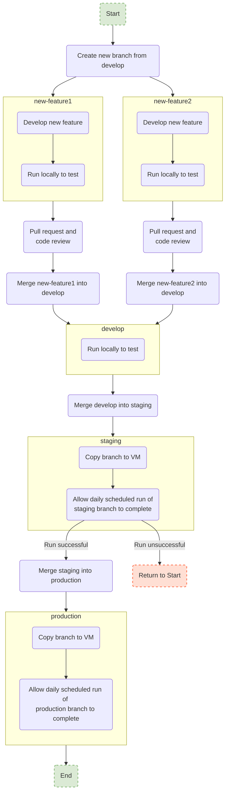

```mermaid
flowchart TB
  subgraph nf1 [new-feature1]
    direction TB
    nf1.1(Develop new feature)
    nf1.2(Run locally to test)
    nf1.1 --> nf1.2
  end
  subgraph nf2 [new-feature2]
    direction TB
    nf2.1(Develop new feature)
    nf2.2(Run locally to test)
    nf2.1 --> nf2.2
  end
  subgraph d [develop]
    d1(Run locally to test)
  end
  subgraph s [staging]
    s1(Copy branch to VM)
    s2(Allow daily scheduled run of <br>staging branch to complete)
    s1 --> s2
  end
  subgraph p [production]
    direction TB
    p1(Copy branch to VM)
    p2(Allow daily scheduled run of <br>production branch to complete)
    p1 --> p2
  end
  start(Start) --> new.branch(Create new branch from develop)
  new.branch --> nf1
  new.branch --> nf2
  pr1(Pull request and <br>code review)
  pr2(Pull request and <br>code review)
  m.fd1(Merge new-feature1 into develop)
  m.fd2(Merge new-feature2 into develop)
  nf1 --> pr1 --> m.fd1 --> d
  nf2 --> pr2 --> m.fd2 --> d
  m.ds(Merge develop into staging)
  d --> m.ds
  m.ds --> s
  s2-- Run successful --> m.sp(Merge staging into production)
  s2-- Run unsuccessful --> return(Return to Start)
  m.sp --> p
  p --> e(End)
  classDef SE fill:#dbead5,stroke:#93bf85,stroke-width:2px,stroke-dasharray: 5 5;
  class start,e SE
  style return fill:#ffdfd4,stroke:#ff7b5a,stroke-width:2px,stroke-dasharray: 5 5
```
