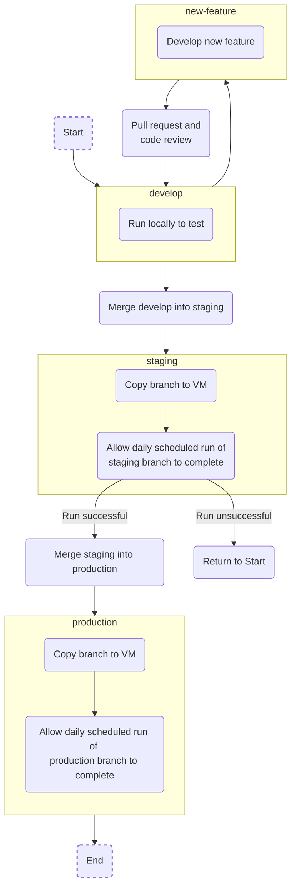

```mermaid
flowchart TB
  subgraph d [develop]
    d1(Run locally to test)
  end
  subgraph f [new-feature]
    f1(Develop new feature)
  end
  subgraph s [staging]
    s1(Copy branch to VM)
    s2(Allow daily scheduled run of <br>staging branch to complete)
    s1 --> s2
  end
  subgraph p [production]
    direction TB
    p1(Copy branch to VM)
    p2(Allow daily scheduled run of <br>production branch to complete)
    p1 --> p2
  end
  start(Start) --> d
  d --> f
  pr(Pull request and <br>code review)
  f --> pr --> d
  m.ds(Merge develop into staging)
  d --> m.ds
  m.ds --> s
  s2-- Run successful --> m.sp(Merge staging into production)
  s2-- Run unsuccessful --> return(Return to Start)
  m.sp --> p
  p --> e(End)
  style start stroke-width:2px,stroke-dasharray: 5 5
  style e stroke-width:2px,stroke-dasharray: 5 5
```

  subgraph fd [Feature Development]
    d{{develop branch}}
    nf{{new-feature branch}}
    pr(Pull request and  code review)
    d --> nf --> pr --> d
  end
