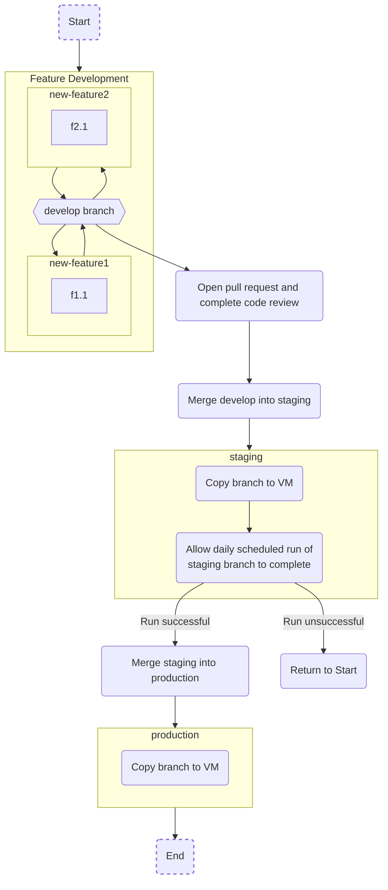

```mermaid
flowchart TB
  subgraph fd [Feature Development]
    d{{develop branch}}
    subgraph f1 [new-feature1]
      f1.1
    end
    subgraph f2 [new-feature2]
      f2.1
    end  
  end
  subgraph s [staging]
    s1(Copy branch to VM)
    s2(Allow daily scheduled run of <br>staging branch to complete)
    s1 --> s2
  end
  subgraph p [production]
    p1(Copy branch to VM)
  end
  start(Start) --> fd
  d --> f1 --> d
  d --> f2 --> d
  pr(Open pull request and complete code review)
  m.ds(Merge develop into staging)
  d --> pr --> m.ds
  m.ds --> s
  s2-- Run successful --> m.sp(Merge staging into production)
  s2-- Run unsuccessful --> return(Return to Start)
  m.sp --> p
  p --> e(End)
  style start stroke-width:2px,stroke-dasharray: 5 5
  style e stroke-width:2px,stroke-dasharray: 5 5
```
